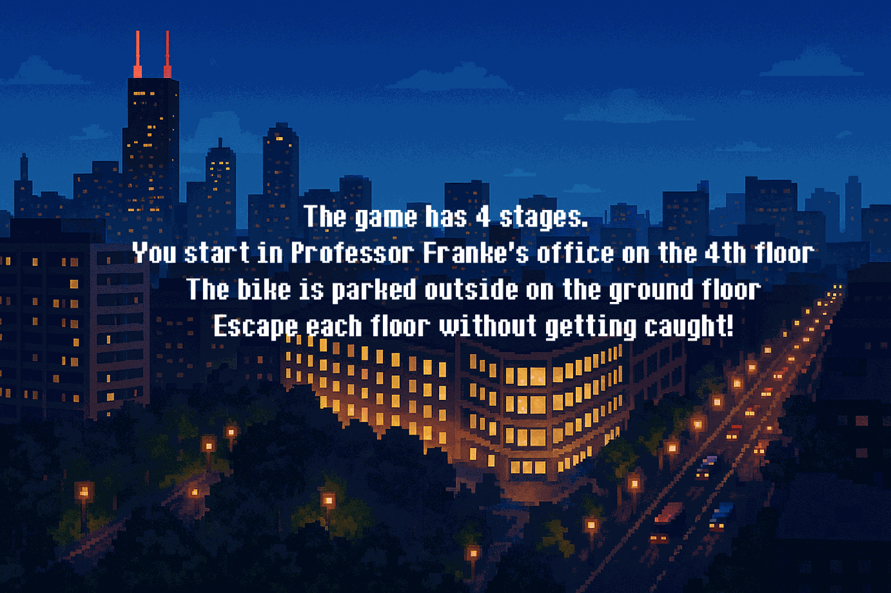
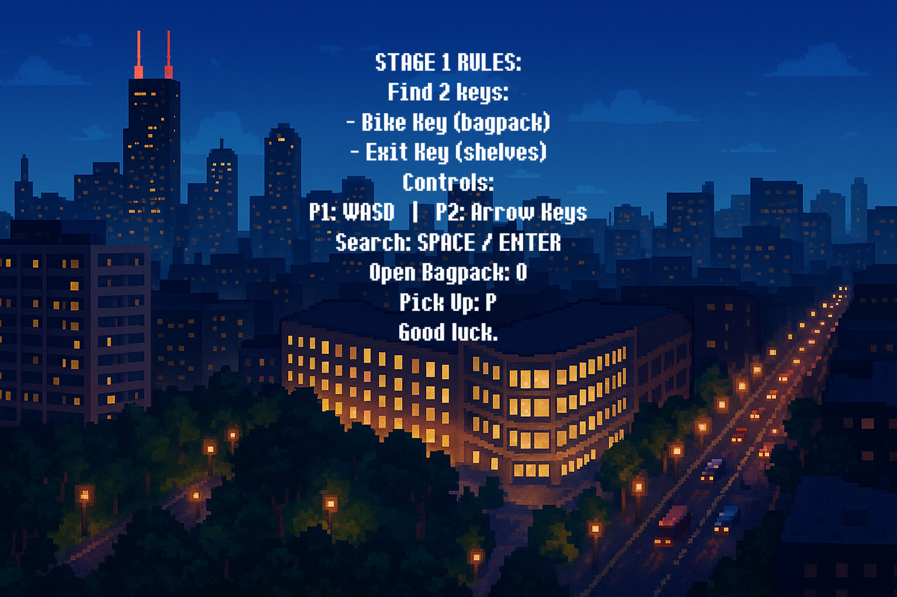
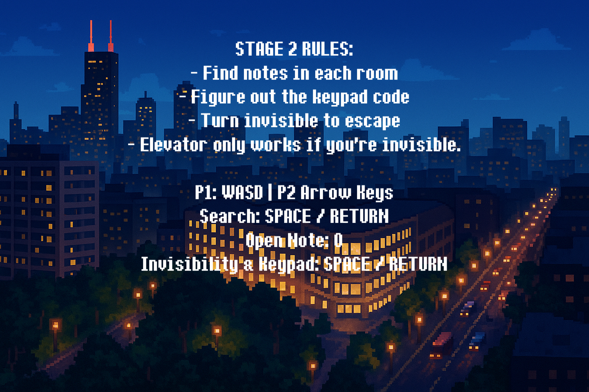
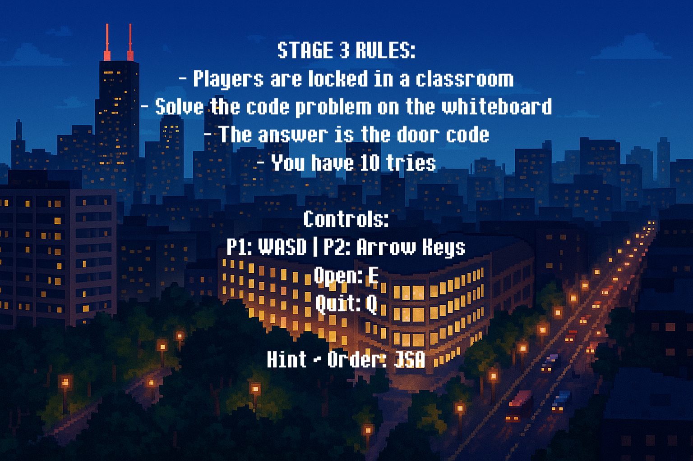
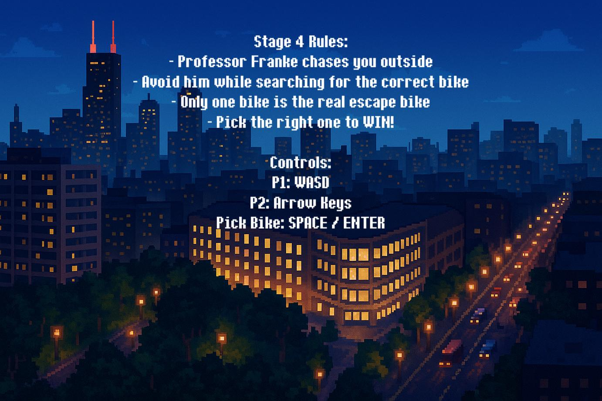

# 🚲 Baker Bike Heist

**CS 111 Final Project — University of Illinois Chicago (UIC)**

Baker Bike Heist is a 2D multiplayer Python game built **entirely from scratch** (no Pygame or external engines).  
Players work together to steal Professor Baker’s bike through **multi-stage puzzles**, culminating in a **final boss fight** with an enraged Evil Professor Baker.

This project was **voted #1 by course TAs** among 60+ final projects.

---

## 🎮 Gameplay Overview

- **Objective:** Steal Professor Baker’s bike  
- **Multiplayer:**  
  - Player 1 → WASD for movement  
  - Player 2 → Arrow keys for movement  
- **Action Keys:** Space, Enter, P (pick up), O (open)  
- **Stages:** Solve puzzles and navigate obstacles to progress  
- **Final Boss:** Fight Evil Professor Baker using fireballs  

---

## 🖼️ Screenshots / GIFs

### Story Screens






*(All assets are custom created by the team.)*

---

## 🧩 Key Features

- Fully custom animations, characters, and backgrounds  
- Multi-stage puzzle progression  
- Event-driven gameplay built entirely in Python Turtle  
- Local multiplayer mechanics  
- Replayable and TA-ranked #1 in CS 111  

---

## 🛠️ Technical Details

- **Language:** Python  
- **Graphics:** Custom-built with `turtle`  
- **Team:** You (Lead), Agnesa Beqiri, Joshua Mam  
- **Platform:** ZyBooks Python environment (works on any OS with Python/Turtle)  

---

## 🚀 How to Run

Clone the repo and run:

```bash
python main.py