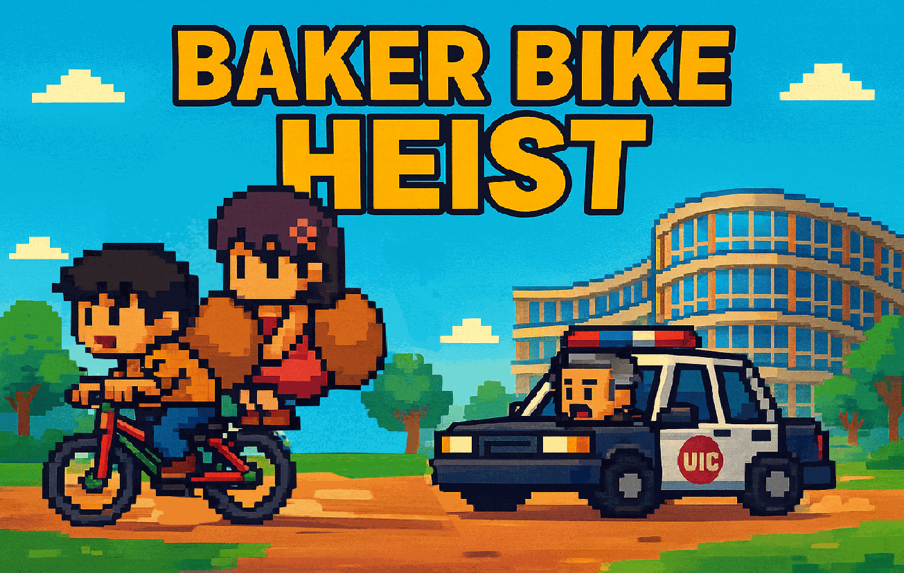
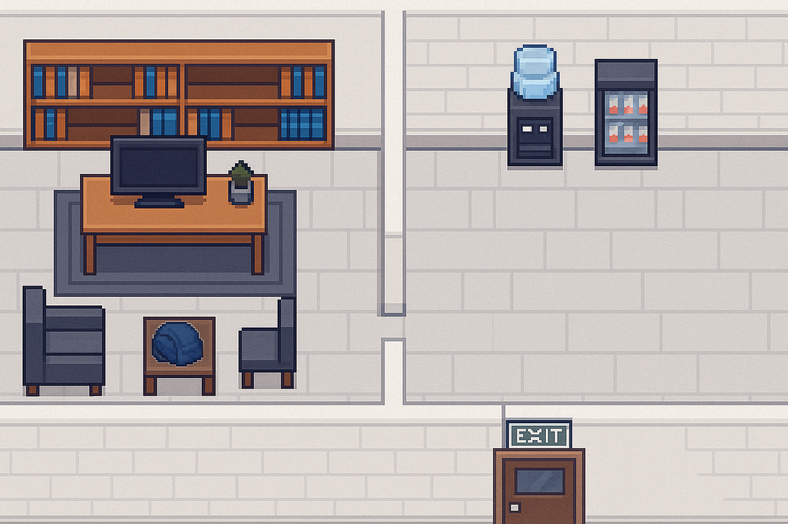
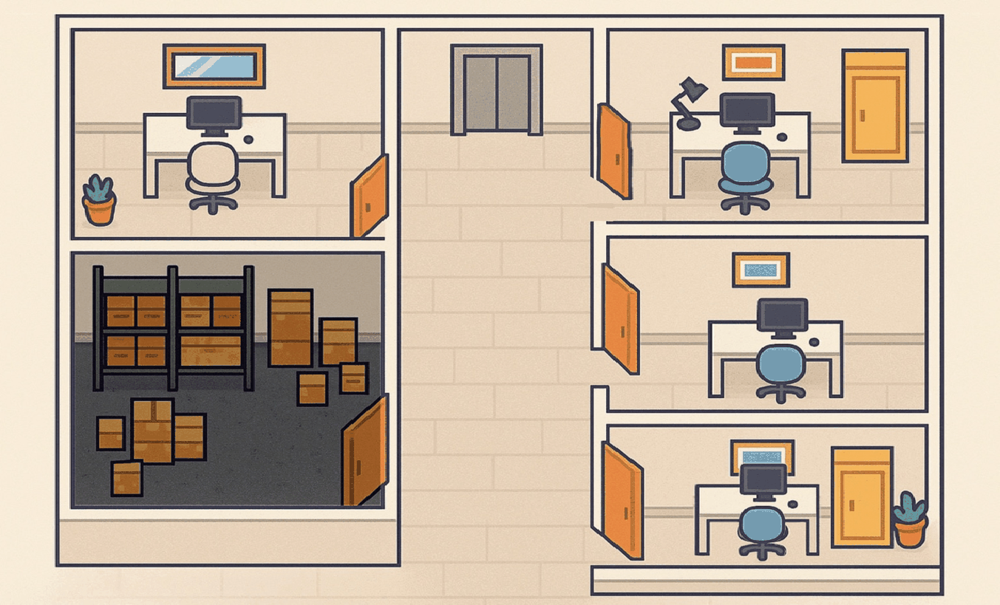
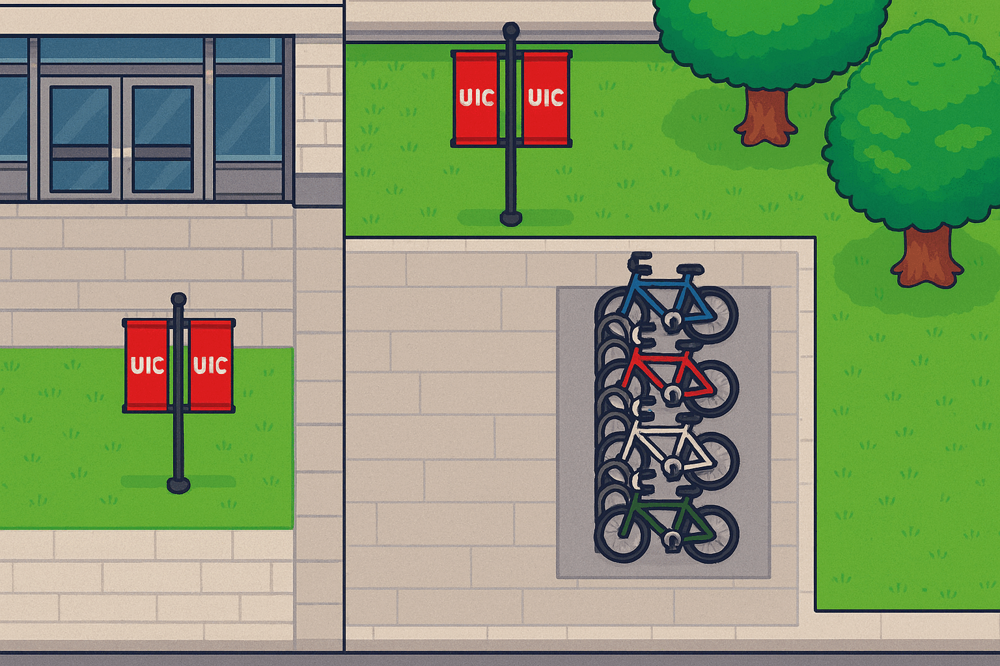
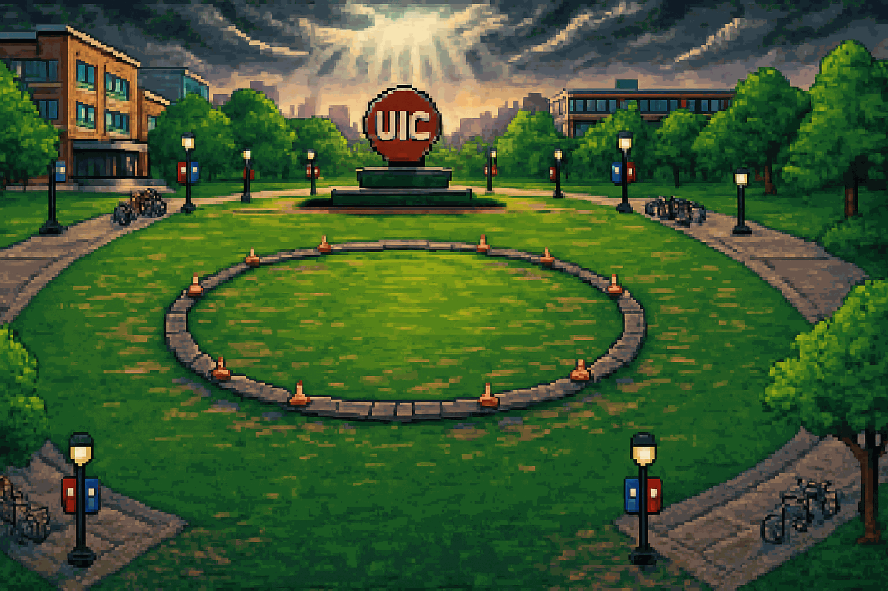

# 🚲 Baker Bike Heist

CS 111 Final Project — University of Illinois Chicago (UIC)

Baker Bike Heist is a 2D multiplayer Python game built entirely from scratch (no Pygame or external engines).  
Players work together to steal Professor Baker’s bike through multi-stage puzzles, culminating in a final boss fight with an enraged Evil Professor Baker.

This project was voted #1 by course TAs among 60+ final projects.

---

## Gameplay Overview

- Objective: Steal Professor Baker’s bike  
- Multiplayer:  
  - Player 1 → WASD for movement  
  - Player 2 → Arrow keys for movement  
- Action Keys: Space, Enter, P (pick up), O (open)  
- Stages: Solve puzzles and navigate obstacles to progress  
- Final Boss: Fight Evil Professor Baker using fireballs  

---

## Screenshots / GIFs

### Story / Start Screens
<p align="center">
  
</p>

### Stage Screens
<p align="center">
  
  
  
</p>

### Final Boss Fight
<p align="center">
  
</p>

### Final Winning Screen
<p align="center">
  
</p>

*(All assets are custom created by the team.)*

---

## Key Features

- Fully custom animations, characters, and backgrounds  
- Multi-stage puzzle progression  
- Event-driven gameplay built entirely in Python Turtle  
- Local multiplayer mechanics  
- Replayable and TA-ranked #1 in CS 111  

---

## Technical Details

- Language: Python  
- Graphics: Custom-built with `turtle`  
- Team: You (Lead), Agnesa Beqiri, Joshua Mam  
- Platform: ZyBooks Python environment (works on any OS with Python/Turtle)  

---

### Controls

- Player 1: WASD + Action keys  
- Player 2: Arrow keys + Action keys  

---

## Notes

- Entirely built from scratch, no external engines  
- Includes all GIFs, animations, and assets used in the game  
- Designed as a final project for CS 111: Program Design I at UIC  
- **Environment Notice:** This game was developed in the ZyBooks Python environment as required for CS 111.  
  It uses hard-coded coordinates and window settings specific to ZyBooks, so it **may not run correctly outside ZyBooks** (e.g., in local Python/Turtle on Mac or Windows).  
  Screenshots and GIFs in this repo show the intended gameplay and visuals. 

---

## How to Run

Clone the repo and run:

```bash
python main.py


